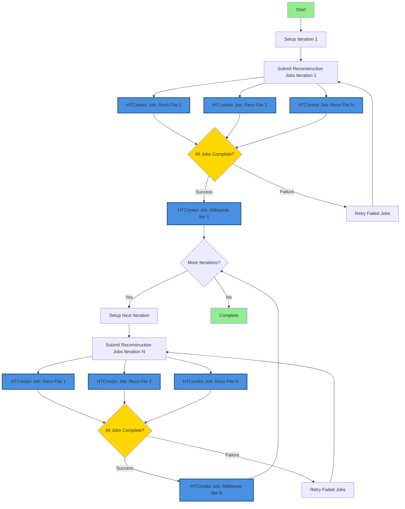
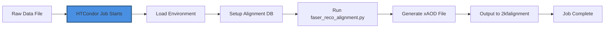
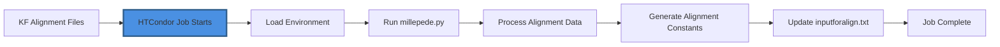

# FASER Alignment with HTCondor

This package submits HTCondor reconstruction jobs and performs Millepede alignment iteratively for the FASER experiment.

## Prerequisites

Before you begin, ensure you have access to:

1. **CERN lxplus** - HTCondor computing cluster
2. **FASER raw data** - Located at `/eos/experiment/faser/raw/`
3. **Calypso** - FASER reconstruction software (installation required)
4. **Storage space**:
   - AFS: ~500 MB for code, config files, and job management
   - EOS: ~25 GB per 10 iterations (50 raw files) for output data

**Required software** (available on lxplus):
- Python 3.6 or newer
- CMake 3.10 or newer
- GCC/G++ compiler
- Git

## 🚀 Quick Start (Recommended: HTCondor DAGman)

The **recommended approach** uses HTCondor DAGman for reliable, officially-supported workflow management on lxplus:

```bash
# 0. Login to lxplus
ssh your-username@lxplus.cern.ch

# 1. Clone this repository (with submodules)
git clone --recursive https://github.com/Eric100911/faser-alignment-script.git /afs/cern.ch/user/y/yourusername/faser-alignment-script
cd /afs/cern.ch/user/y/yourusername/faser-alignment-script/

# 2. Compile Mille (the conversion script)
cd millepede
cmake -B build && cmake --build build && cmake --install build
cd ..

# 3. Compile pede (the alignment solver)
# Choose a location on AFS for pede installation
git clone --depth 1 --branch V04-17-06 \
     https://gitlab.desy.de/claus.kleinwort/millepede-ii.git /afs/cern.ch/user/y/yourusername/pede
cd /afs/cern.ch/user/y/yourusername/pede
make pede
# Test the installation (takes ~10 seconds)
./pede -t
cd -

# 4. Setup configuration
# The script will interactively ask for paths
bash setup_config.sh
# Alternatively, create config.json manually:
# python3 config.py
# Then edit config.json to set your specific paths

# 5. Verify configuration
python3 -c "from config import AlignmentConfig; c = AlignmentConfig(); c.validate_paths()"

# 6. Generate and submit DAG workflow
python3 dag_manager.py -y 2023 -r 011705 -f 400-450 -i 10 --submit

# 7. Monitor progress
condor_q -dag -nobatch
# Or watch the DAGman log in real-time:
# tail -f Y2023_R011705_F400-450/alignment.dag.dagman.out
```

📖 **See [USAGE_GUIDE.md](USAGE_GUIDE.md) for detailed instructions and examples.**

📁 **See [STORAGE_GUIDE.md](STORAGE_GUIDE.md) for AFS/EOS storage configuration and performance optimization.**

## Important: Storage Configuration

For optimal performance on lxplus, use a hybrid storage approach:

**Storage Strategy:**
- **AFS** (Andrew File System): Small quota (~500 MB quota typical)
  - Use for: Code, configuration files, submit files, DAG files, job logs
  - Location: `/afs/cern.ch/user/y/yourusername/`
  
- **EOS** (CERN's disk storage): Large quota (TB scale)
  - Use for: Root files, xAOD files, reconstruction outputs
  - Location: `/eos/user/y/yourusername/` or `/eos/experiment/faser/`

**Key Configuration in `config.json`:**
```json
{
  "paths": {
    "calypso_install": "/afs/cern.ch/user/y/yourusername/calypso/install",
    "pede_install": "/afs/cern.ch/user/y/yourusername/pede",
    "work_dir": "/afs/cern.ch/user/y/yourusername/alignment-work",
    "eos_output_dir": "/eos/user/y/yourusername/faser-alignment-output"
  },
  "storage": {
    "use_eos_for_output": true,
    "keep_intermediate_root_files": true,
    "cleanup_reco_temp_files": true
  }
}
```

**Why this matters:**
- Jobs run on HTCondor execute nodes using local scratch space (not AFS)
- Large temporary files (database files ~100MB each) are stored on execute node's local disk
- HTCondor automatically cleans up execute node storage after job completion
- Only final output files and logs are stored on AFS/EOS
- This prevents AFS quota issues even with 50+ concurrent jobs

See [STORAGE_GUIDE.md](STORAGE_GUIDE.md) for complete storage setup and best practices.

## Legacy Daemon Approach (Not Recommended)

⚠️ **WARNING**: The daemon approach is **not officially supported** on lxplus and may be unreliable.

For legacy compatibility, the `auto_iter.py` script can run iterations automatically as a daemon:
```bash
nohup python3 auto_iter.py -y 2023 -r 011705 -f 450-500 -i 10 &>>auto_iter.log &
```

**Why you should NOT use this approach:**
- Not officially supported on CERN lxplus infrastructure
- Requires persistent background process (daemon) that can fail
- Manual polling for job completion (inefficient)
- No automatic retry logic for failed jobs
- Difficult to monitor and debug
- Not integrated with HTCondor's workflow management

**Migration:** If you're currently using the daemon approach, see [MIGRATION.md](MIGRATION.md) for instructions on migrating to the recommended DAGman approach.

**Recommendation:** ✅ Always use the HTCondor DAGman solution (`dag_manager.py`) for production workflows.


## Source environment

### Event Reconstruction Environment Configuration

The script automatically creates the environment setup script if it does not exist. You need to provide the path to your Calypso installation using the `--calypso_path` argument when running `main.py` for the first time.

If the environment script already exists, it will use the existing one. You can specify a custom path with `--env_script` (default: `reco_condor_env.sh`).

**Required environment script content:**
The environment script should contain the following setup commands:

```bash
#!/bin/bash
export ATLAS_LOCAL_ROOT_BASE=/cvmfs/atlas.cern.ch/repo/ATLASLocalRootBase 
source ${ATLAS_LOCAL_ROOT_BASE}/user/atlasLocalSetup.sh
asetup --input=calypso/asetup.faser Athena,24.0.41
source /path/to/your/calypso/install/setup.sh
```

> ⚠️ **Important Notes:**
> - Replace `/path/to/your/calypso/install` with your actual Calypso installation path when using `--calypso_path`
> - This script will be sourced on HTCondor computing nodes before running reconstruction jobs
> - Make sure the Calypso installation is accessible from HTCondor execute nodes
> - The environment script is shared across all reconstruction jobs

**For HTCondor (DAGman) workflows:**
When using `dag_manager.py`, the environment script path is configured in `config.json`:
```json
{
  "paths": {
    "env_script": "reco_condor_env.sh",
    "calypso_install": "/path/to/calypso/install"
  }
}
```

### Detector Alignment Environment Configuration

The software tool used is **Millepede II**, which consists of two parts: **Mille** and **pede**. 

**Current implementation:**
- **Mille**: Linked in the `millepede` directory, invocation integrated in `faser_alignment.py` script
- **pede**: Needs to be installed and configured separately (see instructions below)

#### Installing `pede`

The source code for `pede` can be obtained from Claus Kleinwort's DESY GitLab repository.

**Installation steps:**

```bash
# 1. Clone the repository
git clone --depth 1 --branch V04-17-06 \
     https://gitlab.desy.de/claus.kleinwort/millepede-ii.git /afs/cern.ch/user/y/yourusername/pede
cd /afs/cern.ch/user/y/yourusername/pede

# 2. Build pede
make pede

# 3. Test the installation (recommended, takes ~10 seconds)
./pede -t
```

**Expected output from test:**
If the test is successful, you should see output indicating that the test cases passed.

> ⚠️ **Important Notes:**
> - Replace `/afs/cern.ch/user/y/yourusername/pede` with your desired installation path
> - **Strongly recommended**: Install `pede` in the same environment as Athena/Calypso to ensure ROOT version consistency
> - Issues from ROOT version incompatibility have been reported - matching versions is critical
> - Keep pede on AFS (not EOS) for better performance (~60 MB size is manageable on AFS)

#### Configuring Environment Variables

In addition to the standard Athena-Calypso setup, adding the `pede` path is required for alignment execution.

**Add to your environment script (`reco_condor_env.sh` or custom script):**

```bash
# Add pede to PATH and LD_LIBRARY_PATH
export PATH=/afs/cern.ch/user/y/yourusername/pede:$PATH
export LD_LIBRARY_PATH=/afs/cern.ch/user/y/yourusername/pede:$LD_LIBRARY_PATH
```

> ⚠️ **Critical for HTCondor:**
> - If running Millepede on HTCondor, these two lines **must** be added to the environment script
> - The environment script is sourced on each HTCondor execute node
> - Without these paths, Millepede jobs will fail with "pede: command not found"

**Verification:**
After setting up the environment, verify pede is accessible:
```bash
source reco_condor_env.sh
which pede
# Should output: /afs/cern.ch/user/y/yourusername/pede/pede
pede --version
# Should output version information
```

## Event Reconstruction with `HTCondor`: `main.py`

**Note:** For production workflows, use `dag_manager.py` instead (see [Auto-Iteration Using HTCondor DAGman](#auto-iteration-using-htcondor-dagman)). The `main.py` script is useful for single-iteration testing or manual job submission.

### Basic usage

**Single file reconstruction:**
```bash
python main.py --year 2023 --run 011705 --file 400 --iteration 1 --calypso_path /afs/cern.ch/user/y/yourusername/calypso/install

# Or use short options
python main.py -y 2023 -r 11705 -f 400 -i 1 --calypso_path /afs/cern.ch/user/y/yourusername/calypso/install
```

### Batch processing multiple raw files

**Process a range of files:**
```bash
# Use range format start-end (inclusive)
python main.py --year 2023 --run 011705 --file 400-450 --iteration 1 --calypso_path /afs/cern.ch/user/y/yourusername/calypso/install

# Use range format start:end (inclusive)
python main.py --year 2023 --run 011705 --file 400:450 --iteration 1 --calypso_path /afs/cern.ch/user/y/yourusername/calypso/install

# Short option form
python main.py -y 2023 -r 11705 -f 400-450 -i 1 --calypso_path /afs/cern.ch/user/y/yourusername/calypso/install
```

**Example for 4-station mode:**
```bash
python main.py -y 2023 -r 11705 -f 400-450 -i 1 --fourst --calypso_path /afs/cern.ch/user/y/yourusername/calypso/install
```

### Parameter description

**Required parameters:**
- `--year, -y`: Year of data taking (e.g., 2022, 2023, 2024, 2025)
- `--run, -r`: Run number (e.g., 011705, will be automatically zero-padded to 6 digits)
- `--file, -f`: Single raw file number (e.g., 400) or range (e.g., 400-450 or 400:450)

**Optional parameters:**
- `--iteration, -i`: Iteration number (default: 1)
- `--fourst`: Enable 4-station reconstruction mode (default: disabled)
- `--threest`: Enable 3-station reconstruction mode (default: enabled)
- `--env_script`: Path to environment setup script (default: `reco_condor_env.sh`)
  - Will be created automatically if it doesn't exist
- `--calypso_path`: Path to Calypso installation (required if `env_script` does not exist)
  - Used to auto-generate the environment script

**Examples:**

```bash
# Process files 400-450 with default 3-station mode
python main.py -y 2023 -r 11705 -f 400-450 -i 1 --calypso_path /path/to/calypso

# Process with custom environment script
python main.py -y 2023 -r 11705 -f 400-450 -i 1 --env_script my_custom_env.sh

# Process single file in 4-station mode
python main.py -y 2023 -r 11705 -f 400 -i 1 --fourst --calypso_path /path/to/calypso
```


## Overall Workflow

This section describes the complete alignment workflow from raw data to final alignment constants.

### Workflow Overview

The alignment process follows these main steps:
1. **Reconstruction**: Convert raw detector data to analysis-ready ROOT files
2. **Alignment Calculation**: Use Millepede to calculate alignment constants from reconstructed tracks
3. **Iteration**: Apply new alignment constants and repeat for improved precision
4. **Convergence**: Continue iterations until alignment constants stabilize

### Performing Initial Event Reconstruction

**Step-by-step process:**

1. **Run the main program** (`main.py` or `dag_manager.py`):
   - Parses the `--file` parameter to determine which raw files to process (handled by `RawList.py`)
   - Creates HTCondor submit files for each raw file
   
2. **Job Submission**:
   - Generates `submit_unbiased.sub` files (one per raw file when using DAGman)
   - Submits jobs to HTCondor with `-spool` option for remote execution
   - Submission details logged in `main.log` (for `main.py`) or DAGman logs (for `dag_manager.py`)
   
3. **HTCondor Execution**:
   - Each HTCondor execute node independently runs the `runAlignment.sh` script
   - The script performs these actions per raw file:
     - Sources the environment script (`reco_condor_env.sh`)
     - Runs `aligndb_copy.sh` to setup alignment database (copies ~100MB database file to local disk)
     - Executes `faser_reco_alignment.py` to perform reconstruction
   - Jobs run on execute node's local disk (not AFS) to avoid quota issues
   
4. **Output Collection**:
   - Reconstructed `.root` files are written to the output directory
   - When using EOS storage: Files go to `/eos/user/y/yourusername/faser-alignment-output/`
   - When using AFS only: Files go to `../2kfalignment/` directory
   - Log files are retrieved with `condor_transfer_data ${Cluster}` (for `main.py`)
   - DAGman automatically handles file transfers for its jobs

**Directory structure after reconstruction:**
```
Y2023_R011705_F400-450/iter01/
├── 1reco/                      # Reconstruction job files
│   ├── reco_00400.sub         # Submit file for file 400
│   ├── reco_00401.sub         # Submit file for file 401
│   ├── ...
│   ├── inputforalign.txt      # Alignment constants (empty for iter 1)
│   └── logs/                  # Job execution logs
└── 2kfalignment/              # Output ROOT files
    ├── kfalignment_00400.root
    ├── kfalignment_00401.root
    └── ...
```

### Performing Alignment with Millepede

The Millepede alignment process is integrated into the `millepede/bin/millepede.py` script, which greatly simplifies the workflow.

**Prerequisites:**
- Ensure `pede` is in your `$PATH` and `$LD_LIBRARY_PATH`
- Verify installation: `which pede` should return the path to pede executable

**Running Millepede:**

Execute the `millepede/bin/millepede.py` script from any directory, specifying the input path:

```bash
# Basic usage - specify the reconstruction output directory
python /afs/cern.ch/user/y/yourusername/faser-alignment-script/millepede/bin/millepede.py \
  -i /eos/user/y/yourusername/faser-alignment-output/Y2023_R011705_F400-450/iter01/2kfalignment/

# The script will:
# 1. Process all kfalignment_*.root files in the input directory
# 2. Run Mille to convert ROOT files to binary format
# 3. Run pede to calculate alignment constants
# 4. Generate alignment output files
```

**Expected output:**
- `millepede.res` - Results file with alignment parameters
- `millepede.his` - Histogram file for quality checks
- `inputforalign.txt` - Alignment constants for next iteration (auto-generated)

**Processing time:**
- Typically takes only a few minutes for ROOT files from 50 raw files
- Time scales roughly linearly with number of files
- Most time spent in pede calculation phase

**Output location:**
```
Y2023_R011705_F400-450/iter01/
└── 3millepede/                # Millepede output directory
    ├── millepede.res          # Alignment results
    ├── millepede.his          # Quality histograms
    ├── inputforalign.txt      # Constants for next iteration
    └── millepede.out          # Execution log
```

### Iterate with Alignment Constants

Iterative refinement is necessary to achieve optimal alignment precision.

**Why iteration is needed:**
- Initial alignment is approximate
- Each iteration refines the detector position parameters
- Convergence typically achieved in 5-10 iterations
- Monitor chi-squared values to assess convergence

**Running the next iteration:**

The alignment constants from the previous iteration are automatically loaded for the next reconstruction:

```bash
# Using main.py (manual approach)
python main.py -y 2023 -r 11705 -f 400-450 -i 2 --calypso_path /path/to/calypso/install

# Using dag_manager.py (automated approach - RECOMMENDED)
# All iterations are automatically chained in the DAG
python3 dag_manager.py -y 2023 -r 011705 -f 400-450 -i 10 --submit
```

**What happens during iteration:**
1. New reconstruction jobs use `inputforalign.txt` from previous iteration
2. The alignment database is updated with new constants before reconstruction
3. Improved track fits produce better alignment parameters
4. Process repeats until constants stabilize (convergence)

**Monitoring convergence:**
- Check chi-squared values in `millepede.res` files
- Compare alignment constants between iterations
- Constants should change less with each iteration
- Typically converged when changes < 0.1% between iterations

**Automatic iteration with DAGman:**
When using `dag_manager.py`, all iterations are managed automatically:
- Each iteration waits for previous iteration's Millepede to complete
- Alignment constants automatically propagated between iterations
- Failed jobs are automatically retried
- No manual intervention needed between iterations

### Alignment Process Diagram


## Auto-Iteration Using HTCondor DAGman

### Overview

HTCondor DAGman (Directed Acyclic Graph Manager) provides a robust solution for managing iterative alignment workflows on CERN's lxplus infrastructure. Unlike daemon-based approaches, DAGman is officially supported and provides:

- **Automatic job dependency management**: Ensures reconstruction completes before alignment
- **Built-in retry logic**: Handles transient failures automatically
- **Progress tracking**: Monitor workflow status with standard HTCondor tools
- **No daemon required**: Eliminates need for persistent background processes
- **Better resource management**: Integrates with HTCondor's scheduling system

### Workflow Architecture

The DAGman-based workflow follows this process:



**Key Components:**

1. **DAG File**: Defines job dependencies and workflow structure
2. **Reconstruction Jobs** (Blue nodes): Multiple parallel HTCondor jobs, one per raw data file
3. **Millepede Job** (Blue node): Single HTCondor job per iteration for alignment calculation
4. **Iteration Chaining**: Each iteration depends on previous iteration's completion
5. **Automatic Retry**: Failed jobs are retried according to configured policy

**Note**: HTCondor jobs are highlighted in blue with thick borders. Each reconstruction phase submits multiple jobs (one per file), while each alignment phase submits a single Millepede job.

**Parallel Execution**: Each raw data file has its own DAG node and submit file, allowing HTCondor to schedule and run all reconstruction jobs in parallel across available resources. For example, with 50 files (400-450), all 50 reconstruction jobs can run simultaneously if resources are available, significantly reducing total processing time compared to sequential execution.

#### Detailed Sub-Process Diagrams

**Reconstruction Job Process (per file):**



**Millepede Job Process (per iteration):**



### Configuration Management

Path configuration is now centralized in `config.json`:

```json
{
  "paths": {
    "calypso_install": "/path/to/calypso/install",
    "pede_install": "/path/to/pede",
    "env_script": "reco_condor_env.sh"
  },
  "htcondor": {
    "job_flavour": "longlunch",
    "request_cpus": 1,
    "max_retries": 3,
    "requirements": "(Machine =!= LastRemoteHost) && (OpSysAndVer =?= \"AlmaLinux9\")"
  },
  "alignment": {
    "default_iterations": 10,
    "polling_interval_seconds": 300
  }
}
```

**Setup:**
1. Create configuration file:
   ```bash
   python config.py
   ```

2. Edit `config.json` to set your installation paths

3. Validate configuration:
   ```bash
   python -c "from config import AlignmentConfig; c = AlignmentConfig(); c.validate_paths()"
   ```

### Basic Usage

**Generate and submit a DAG workflow:**

```bash
# Generate DAG for 10 iterations
python dag_manager.py --year 2023 --run 011705 --files 400-450 --iterations 10

# Generate and auto-submit
python dag_manager.py -y 2023 -r 011705 -f 400-450 -i 10 --submit
```

**Monitor DAG progress:**

```bash
# Check DAG status
condor_q

# View DAG node status
condor_q -dag

# Check specific DAG
condor_q -nobatch

# View DAGman log
tail -f Y2023_R011705_F400-450/alignment.dag.dagman.out
```

**DAG Management:**

```bash
# Remove DAG from queue
condor_rm <DAGman_job_id>

# Rescue a failed DAG (retry from last successful point)
condor_submit_dag Y2023_R011705_F400-450/alignment.dag.rescue001
```

### Generated Directory Structure

```
Y2023_R011705_F400-450/
├── alignment.dag              # Main DAG file
├── alignment.dag.dagman.out   # DAGman execution log
├── alignment.dag.lib.out      # DAGman library log
├── alignment.dag.lib.err      # DAGman library errors
├── iter01/
│   ├── 1reco/
│   │   ├── reco_00400.sub    # Reconstruction submit file for file 400
│   │   ├── reco_00401.sub    # Reconstruction submit file for file 401
│   │   ├── ...               # One submit file per raw file
│   │   ├── reco_00450.sub    # Reconstruction submit file for file 450
│   │   ├── inputforalign.txt # Alignment constants (empty for iter 1)
│   │   ├── logs/             # Job logs
│   │   └── <run>/<file>/     # Per-file work directories
│   ├── 2kfalignment/         # KF alignment output files
│   └── 3millepede/
│       ├── millepede.sub     # Millepede submit file
│       ├── run_millepede.sh  # Millepede wrapper script
│       └── millepede.out     # Millepede output
├── iter02/
│   └── ...                   # Same structure for each iteration
└── ...
```

### Advantages over Daemon Approach

| Feature | Daemon (`auto_iter.py`) | DAGman (`dag_manager.py`) |
|---------|------------------------|---------------------------|
| **Supported on lxplus** | ❌ Not officially supported | ✅ Officially supported |
| **Job Dependency** | Manual polling | Automatic by HTCondor |
| **Failure Handling** | Script-based | Built-in retry logic |
| **Monitoring** | Custom logs | Standard HTCondor tools |
| **Resource Usage** | Persistent process | No persistent process |
| **Scalability** | Limited | Excellent |
| **Parallel Execution** | Sequential per-file processing | All files processed in parallel |
| **Recovery** | Manual intervention | Automatic rescue DAGs |

### Migration from Daemon

**Old approach (daemon-based):**
```bash
nohup python3 auto_iter.py -y 2023 -r 011705 -f 450-500 -i 10 &>>auto_iter.log &
```

**New approach (DAGman-based):**
```bash
python dag_manager.py -y 2023 -r 011705 -f 450-500 -i 10 --submit
```

The DAGman approach provides the same functionality with better reliability and is the recommended method for production workflows.

### Log files
After job execution, log files are saved in the `logs/` directory:
- `reco_$(Process).out` - Reconstruction standard output
- `reco_$(Process).err` - Reconstruction error output
- `reco_$(Process).log` - Reconstruction HTCondor log
- `millepede.out` - Millepede standard output
- `millepede.err` - Millepede error output
- `millepede.log` - Millepede HTCondor log