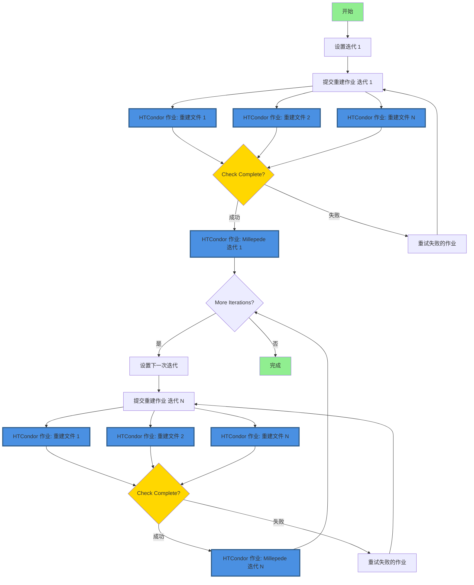

# 使用 HTCondor 进行 FASER 对齐

本软件包用于提交 HTCondor 重建作业，并为 FASER 实验迭代执行 Millepede 对齐。

## 前提条件

在开始之前，请确保您可以访问：

1. **CERN lxplus** - HTCondor 计算集群
2. **FASER 原始数据** - 位于 `/eos/experiment/faser/raw/`
3. **Calypso** - FASER 重建软件（需要安装）
4. **存储空间**:
   - AFS：约 500 MB 用于代码、配置文件和作业管理
   - EOS：每 10 次迭代（50 个原始文件）约 25 GB 用于输出数据

**所需软件**（lxplus 上可用）：
- Python 3.6 或更高版本
- CMake 3.10 或更高版本
- GCC/G++ 编译器
- Git

## 🚀 快速开始（推荐：HTCondor DAGman）

**推荐方法**使用 HTCondor DAGman 在 lxplus 上进行可靠的、官方支持的工作流管理：

```bash
# 0. 登录到 lxplus
ssh your-username@lxplus.cern.ch

# 1. 克隆此仓库（包含子模块）
git clone --recursive https://github.com/Eric100911/faser-alignment-script.git /afs/cern.ch/user/y/yourusername/faser-alignment-script
cd /afs/cern.ch/user/y/yourusername/faser-alignment-script/

# 2. 编译 Mille（转换脚本）
cd millepede
cmake -B build && cmake --build build && cmake --install build
cd ..

# 3. 编译 pede（对齐求解器）
# 在 AFS 上选择 pede 安装位置
git clone --depth 1 --branch V04-17-06 \
     https://gitlab.desy.de/claus.kleinwort/millepede-ii.git /afs/cern.ch/user/y/yourusername/pede
cd /afs/cern.ch/user/y/yourusername/pede
make pede
# 测试安装（大约 10 秒）
./pede -t
cd -

# 4. 设置配置
# 脚本将交互式询问路径
bash setup_config.sh
# 或者，手动创建 config.json：
# python3 config.py
# 然后编辑 config.json 设置您的特定路径

# 5. 验证配置
python3 -c "from config import AlignmentConfig; c = AlignmentConfig(); c.validate_paths()"

# 6. 生成并提交 DAG 工作流
python3 dag_manager.py -y 2023 -r 011705 -f 400-450 -i 10 --submit

# 7. 监控进度
condor_q -dag -nobatch
# 或实时查看 DAGman 日志：
# tail -f Y2023_R011705_F400-450/alignment.dag.dagman.out
```

📖 **详细说明请参见 [USAGE_GUIDE_cn.md](USAGE_GUIDE_cn.md)。**

📁 **AFS/EOS 存储配置和性能优化请参见 [STORAGE_GUIDE_cn.md](STORAGE_GUIDE_cn.md)。**

## 旧版守护进程方法（不推荐）

⚠️ **警告**：守护进程方法在 lxplus 上**不受官方支持**，可能不可靠。

为了保持向后兼容，`auto_iter.py` 脚本可以作为守护进程自动运行迭代：
```bash
nohup python3 auto_iter.py -y 2023 -r 011705 -f 450-500 -i 10 &>>auto_iter.log &
```

**为什么不应该使用这种方法：**
- CERN lxplus 基础设施不官方支持
- 需要持久后台进程（守护进程），可能失败
- 手动轮询作业完成（效率低下）
- 没有自动重试失败作业的逻辑
- 难以监控和调试
- 未与 HTCondor 的工作流管理集成

**迁移：** 如果您当前正在使用守护进程方法，请参阅 [MIGRATION_cn.md](MIGRATION_cn.md) 了解迁移到推荐的 DAGman 方法的说明。

**建议：** ✅ 始终使用 HTCondor DAGman 解决方案（`dag_manager.py`）进行生产工作流。

## 重要：存储配置

为了在 lxplus 上获得最佳性能，请使用混合存储策略：

**存储策略：**
- **AFS**（Andrew File System）：小配额（通常约 500 MB 配额）
  - 用于：代码、配置文件、提交文件、DAG 文件、作业日志
  - 位置：`/afs/cern.ch/user/y/yourusername/`
  
- **EOS**（CERN 磁盘存储）：大配额（TB 级别）
  - 用于：Root 文件、xAOD 文件、重建输出
  - 位置：`/eos/user/y/yourusername/` 或 `/eos/experiment/faser/`

**`config.json` 中的关键配置：**
```json
{
  "paths": {
    "calypso_install": "/afs/cern.ch/user/y/yourusername/calypso/install",
    "pede_install": "/afs/cern.ch/user/y/yourusername/pede",
    "work_dir": "/afs/cern.ch/user/y/yourusername/alignment-work",
    "eos_output_dir": "/eos/user/y/yourusername/faser-alignment-output"
  },
  "storage": {
    "use_eos_for_output": true,
    "keep_intermediate_root_files": true,
    "cleanup_reco_temp_files": true
  }
}
```

**为什么这很重要：**
- 作业在 HTCondor 执行节点上运行，使用本地临时空间（而不是 AFS）
- 大型临时文件（数据库文件每个约 100MB）存储在执行节点的本地磁盘上
- HTCondor 在作业完成后自动清理执行节点存储
- 只有最终输出文件和日志存储在 AFS/EOS 上
- 这样即使有 50 多个并发作业也能防止 AFS 配额问题

完整存储设置和最佳实践请参见 [STORAGE_GUIDE_cn.md](STORAGE_GUIDE_cn.md)。

## 环境配置

### 事例重建环境配置

脚本会在环境脚本不存在时自动创建。首次运行 `main.py` 时，您需要使用 `--calypso_path` 参数提供 Calypso 安装路径。

如果环境脚本已存在，将直接使用现有脚本。可通过 `--env_script` 参数指定自定义路径（默认：`reco_condor_env.sh`）。

**所需的环境脚本内容：**
环境脚本应包含以下设置命令：

```bash
#!/bin/bash
export ATLAS_LOCAL_ROOT_BASE=/cvmfs/atlas.cern.ch/repo/ATLASLocalRootBase 
source ${ATLAS_LOCAL_ROOT_BASE}/user/atlasLocalSetup.sh
asetup --input=calypso/asetup.faser Athena,24.0.41
source /path/to/your/calypso/install/setup.sh
```

> ⚠️ **重要提示：**
> - 使用 `--calypso_path` 时，请将 `/path/to/your/calypso/install` 替换为您实际的 Calypso 安装路径
> - 此脚本将在运行重建作业之前在 HTCondor 计算节点上被 source
> - 确保 Calypso 安装可以从 HTCondor 执行节点访问
> - 环境脚本在所有重建作业之间共享

**对于 HTCondor（DAGman）工作流：**
使用 `dag_manager.py` 时，环境脚本路径在 `config.json` 中配置：
```json
{
  "paths": {
    "env_script": "reco_condor_env.sh",
    "calypso_install": "/path/to/calypso/install"
  }
}
```

### 探测器对齐环境配置

使用的软件工具是 **Millepede II**，它由两部分组成：**Mille** 和 **pede**。

**当前实现：**
- **Mille**：链接在 `millepede` 目录中，调用集成在 `faser_alignment.py` 脚本中
- **pede**：需要单独安装和配置（见下面的说明）

#### 安装 `pede`

`pede` 的源代码可以从 Claus Kleinwort 的 DESY GitLab 仓库获得。

**安装步骤：**

```bash
# 1. 克隆仓库
git clone --depth 1 --branch V04-17-06 \
     https://gitlab.desy.de/claus.kleinwort/millepede-ii.git /afs/cern.ch/user/y/yourusername/pede
cd /afs/cern.ch/user/y/yourusername/pede

# 2. 构建 pede
make pede

# 3. 测试安装（推荐，大约 10 秒）
./pede -t
```

**测试的预期输出：**
如果测试成功，您应该看到输出指示测试案例通过。

> ⚠️ **重要提示：**
> - 将 `/afs/cern.ch/user/y/yourusername/pede` 替换为您想要的安装路径
> - **强烈建议**：在与 Athena/Calypso 相同的环境中安装 `pede`，以确保 ROOT 版本一致性
> - 已有报告显示 ROOT 版本不兼容会导致问题 - 版本匹配至关重要
> - 将 pede 保存在 AFS（而不是 EOS）上以获得更好的性能（约 60 MB 大小在 AFS 上可管理）

#### 配置环境变量

除了标准的 Athena-Calypso 设置外，对齐执行还需要添加 `pede` 路径。

**添加到您的环境脚本（`reco_condor_env.sh` 或自定义脚本）：**

```bash
# 将 pede 添加到 PATH 和 LD_LIBRARY_PATH
export PATH=/afs/cern.ch/user/y/yourusername/pede:$PATH
export LD_LIBRARY_PATH=/afs/cern.ch/user/y/yourusername/pede:$LD_LIBRARY_PATH
```

> ⚠️ **对于 HTCondor 至关重要：**
> - 如果在 HTCondor 上运行 Millepede，这两行**必须**添加到环境脚本中
> - 环境脚本在每个 HTCondor 执行节点上被 source
> - 没有这些路径，Millepede 作业将失败并显示 "pede: command not found"

**验证：**
设置环境后，验证 pede 可访问：
```bash
source reco_condor_env.sh
which pede
# 应该输出：/afs/cern.ch/user/y/yourusername/pede/pede
pede --version
# 应该输出版本信息
```


## 使用 `HTCondor` 进行事例重建：`main.py`

**注意：** 对于生产工作流，请改用 `dag_manager.py`（参见 [使用 HTCondor DAGman 进行自动迭代](#使用-htcondor-dagman-进行自动迭代)）。`main.py` 脚本对于单次迭代测试或手动作业提交很有用。

### 基本用法

**单文件重建：**
```bash
python main.py --year 2023 --run 011705 --file 400 --iteration 1 --calypso_path /afs/cern.ch/user/y/yourusername/calypso/install

# 或使用简短参数
python main.py -y 2023 -r 11705 -f 400 -i 1 --calypso_path /afs/cern.ch/user/y/yourusername/calypso/install
```

### 批量处理多个原始文件

**处理文件范围：**
```bash
# 使用范围格式 start-end（包含）
python main.py --year 2023 --run 011705 --file 400-450 --iteration 1 --calypso_path /afs/cern.ch/user/y/yourusername/calypso/install

# 使用范围格式 start:end（包含）
python main.py --year 2023 --run 011705 --file 400:450 --iteration 1 --calypso_path /afs/cern.ch/user/y/yourusername/calypso/install

# 简短参数形式
python main.py -y 2023 -r 11705 -f 400-450 -i 1 --calypso_path /afs/cern.ch/user/y/yourusername/calypso/install
```

**4站模式示例：**
```bash
python main.py -y 2023 -r 11705 -f 400-450 -i 1 --fourst --calypso_path /afs/cern.ch/user/y/yourusername/calypso/install
```

### 参数说明

**必需参数：**
- `--year, -y`：数据采集年份（例如：2022、2023、2024、2025）
- `--run, -r`：运行编号（例如：011705，会自动补零到 6 位数字）
- `--file, -f`：单个原始文件编号（例如：400）或范围（例如：400-450 或 400:450）

**可选参数：**
- `--iteration, -i`：迭代编号（默认：1）
- `--fourst`：启用 4 站重建模式（默认：禁用）
- `--threest`：启用 3 站重建模式（默认：启用）
- `--env_script`：环境设置脚本的路径（默认：`reco_condor_env.sh`）
  - 如果不存在将自动创建
- `--calypso_path`：Calypso 安装路径（如果 `env_script` 不存在则必需）
  - 用于自动生成环境脚本

**示例：**

```bash
# 使用默认 3 站模式处理文件 400-450
python main.py -y 2023 -r 11705 -f 400-450 -i 1 --calypso_path /path/to/calypso

# 使用自定义环境脚本处理
python main.py -y 2023 -r 11705 -f 400-450 -i 1 --env_script my_custom_env.sh

# 在 4 站模式下处理单个文件
python main.py -y 2023 -r 11705 -f 400 -i 1 --fourst --calypso_path /path/to/calypso
```


## 整体工作流

本节描述从原始数据到最终对齐常数的完整对齐工作流。

### 工作流概述

对齐过程遵循以下主要步骤：
1. **重建**：将原始探测器数据转换为可分析的 ROOT 文件
2. **对齐计算**：使用 Millepede 从重建轨迹计算对齐常数
3. **迭代**：应用新的对齐常数并重复以提高精度
4. **收敛**：继续迭代直到对齐常数稳定

### 执行初始事例重建

**分步过程：**

1. **运行主程序**（`main.py` 或 `dag_manager.py`）：
   - 解析 `--file` 参数以确定要处理的原始文件（由 `RawList.py` 处理）
   - 为每个原始文件创建 HTCondor 提交文件
   
2. **作业提交**：
   - 生成 `submit_unbiased.sub` 文件（使用 DAGman 时每个原始文件一个）
   - 使用 `-spool` 选项将作业提交到 HTCondor 进行远程执行
   - 提交详情记录在 `main.log`（对于 `main.py`）或 DAGman 日志（对于 `dag_manager.py`）中
   
3. **HTCondor 执行**：
   - 每个 HTCondor 执行节点独立运行 `runAlignment.sh` 脚本
   - 脚本对每个原始文件执行以下操作：
     - Source 环境脚本（`reco_condor_env.sh`）
     - 运行 `aligndb_copy.sh` 设置对齐数据库（将约 100MB 数据库文件复制到本地磁盘）
     - 执行 `faser_reco_alignment.py` 执行重建
   - 作业在执行节点的本地磁盘上运行（而不是 AFS）以避免配额问题
   
4. **输出收集**：
   - 重建的 `.root` 文件写入输出目录
   - 使用 EOS 存储时：文件存入 `/eos/user/y/yourusername/faser-alignment-output/`
   - 仅使用 AFS 时：文件存入 `../2kfalignment/` 目录
   - 日志文件使用 `condor_transfer_data ${Cluster}` 检索（对于 `main.py`）
   - DAGman 自动处理其作业的文件传输

**重建后的目录结构：**
```
Y2023_R011705_F400-450/iter01/
├── 1reco/                      # 重建作业文件
│   ├── reco_00400.sub         # 文件 400 的提交文件
│   ├── reco_00401.sub         # 文件 401 的提交文件
│   ├── ...
│   ├── inputforalign.txt      # 对齐常数（iter 1 为空）
│   └── logs/                  # 作业执行日志
└── 2kfalignment/              # 输出 ROOT 文件
    ├── kfalignment_00400.root
    ├── kfalignment_00401.root
    └── ...
```

### 使用 Millepede 进行对齐

Millepede 对齐过程集成到 `millepede/bin/millepede.py` 脚本中，大大简化了工作流。

**前提条件：**
- 确保 `pede` 在您的 `$PATH` 和 `$LD_LIBRARY_PATH` 中
- 验证安装：`which pede` 应返回 pede 可执行文件的路径

**运行 Millepede：**

从任何目录执行 `millepede/bin/millepede.py` 脚本，指定输入路径：

```bash
# 基本用法 - 指定重建输出目录
python /afs/cern.ch/user/y/yourusername/faser-alignment-script/millepede/bin/millepede.py \
  -i /eos/user/y/yourusername/faser-alignment-output/Y2023_R011705_F400-450/iter01/2kfalignment/

# 脚本将：
# 1. 处理输入目录中的所有 kfalignment_*.root 文件
# 2. 运行 Mille 将 ROOT 文件转换为二进制格式
# 3. 运行 pede 计算对齐常数
# 4. 生成对齐输出文件
```

**预期输出：**
- `millepede.res` - 带有对齐参数的结果文件
- `millepede.his` - 用于质量检查的直方图文件
- `inputforalign.txt` - 下一次迭代的对齐常数（自动生成）

**处理时间：**
- 对于来自 50 个原始文件的 ROOT 文件，通常只需几分钟
- 时间与文件数量大致成线性关系
- 大部分时间花在 pede 计算阶段

**输出位置：**
```
Y2023_R011705_F400-450/iter01/
└── 3millepede/                # Millepede 输出目录
    ├── millepede.res          # 对齐结果
    ├── millepede.his          # 质量直方图
    ├── inputforalign.txt      # 下一次迭代的常数
    └── millepede.out          # 执行日志
```

### 使用对齐常数进行迭代

迭代细化对于实现最佳对齐精度是必要的。

**为什么需要迭代：**
- 初始对齐是近似的
- 每次迭代都会细化探测器位置参数
- 通常在 5-10 次迭代中实现收敛
- 监控卡方值以评估收敛

**运行下一次迭代：**

来自上一次迭代的对齐常数会自动加载用于下一次重建：

```bash
# 使用 main.py（手动方法）
python main.py -y 2023 -r 11705 -f 400-450 -i 2 --calypso_path /path/to/calypso/install

# 使用 dag_manager.py（自动化方法 - 推荐）
# 所有迭代在 DAG 中自动链接
python3 dag_manager.py -y 2023 -r 011705 -f 400-450 -i 10 --submit
```

**迭代期间发生的事情：**
1. 新的重建作业使用上一次迭代的 `inputforalign.txt`
2. 在重建之前使用新常数更新对齐数据库
3. 改进的轨迹拟合产生更好的对齐参数
4. 过程重复直到常数稳定（收敛）

**监控收敛：**
- 检查 `millepede.res` 文件中的卡方值
- 比较迭代之间的对齐常数
- 常数应该随着每次迭代而变化更少
- 通常当迭代之间的变化 < 0.1% 时收敛

**使用 DAGman 的自动迭代：**
使用 `dag_manager.py` 时，所有迭代都会自动管理：
- 每次迭代等待上一次迭代的 Millepede 完成
- 对齐常数在迭代之间自动传播
- 失败的作业会自动重试
- 迭代之间无需手动干预

## 使用 HTCondor DAGman 进行自动迭代

### 概述

HTCondor DAGman（有向无环图管理器）为 CERN lxplus 基础设施上的迭代对齐工作流管理提供了可靠的解决方案。与基于守护进程的方法不同，DAGman 受官方支持并提供：

- **自动作业依赖管理**：确保重建在对齐之前完成
- **内置重试逻辑**：自动处理瞬时故障
- **进度跟踪**：使用标准 HTCondor 工具监控工作流状态
- **无需守护进程**：消除持久后台进程的需求
- **更好的资源管理**：与 HTCondor 的调度系统集成

### 工作流架构

基于 DAGman 的工作流遵循以下流程：



**关键组件：**

1. **DAG 文件**：定义作业依赖关系和工作流结构
2. **重建作业**（蓝色节点）：多个并行 HTCondor 作业，每个原始数据文件一个作业
3. **Millepede 作业**（蓝色节点）：每次迭代一个 HTCondor 作业用于对齐计算
4. **迭代链接**：每次迭代取决于上一次迭代的完成
5. **自动重试**：根据配置的策略重试失败的作业

**注意**：HTCondor 作业以蓝色和粗边框突出显示。每个重建阶段提交多个作业（每个文件一个），而每个对齐阶段提交单个 Millepede 作业。

#### 详细子流程图

**重建作业流程（每个文件）：**


**Millepede 作业流程（每次迭代）：**


### 日志文件
作业执行后，日志文件会保存在 `logs/` 目录：
- `job_$(Cluster)_$(Process).out` - 标准输出
- `job_$(Cluster)_$(Process).err` - 错误输出  
- `job_$(Cluster)_$(Process).log` - Condor日志